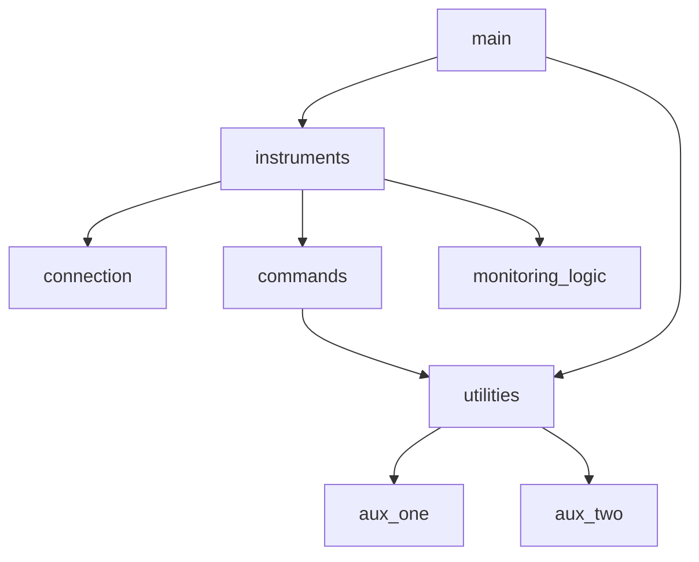
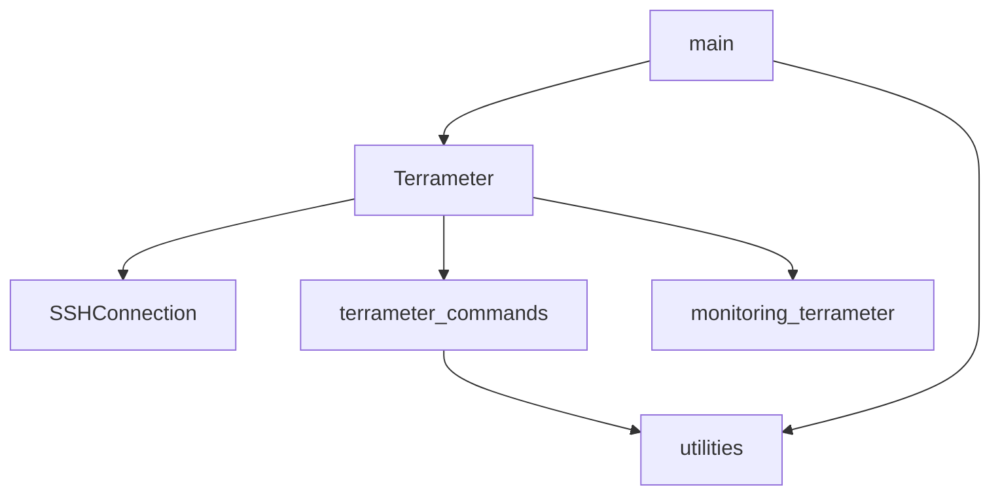
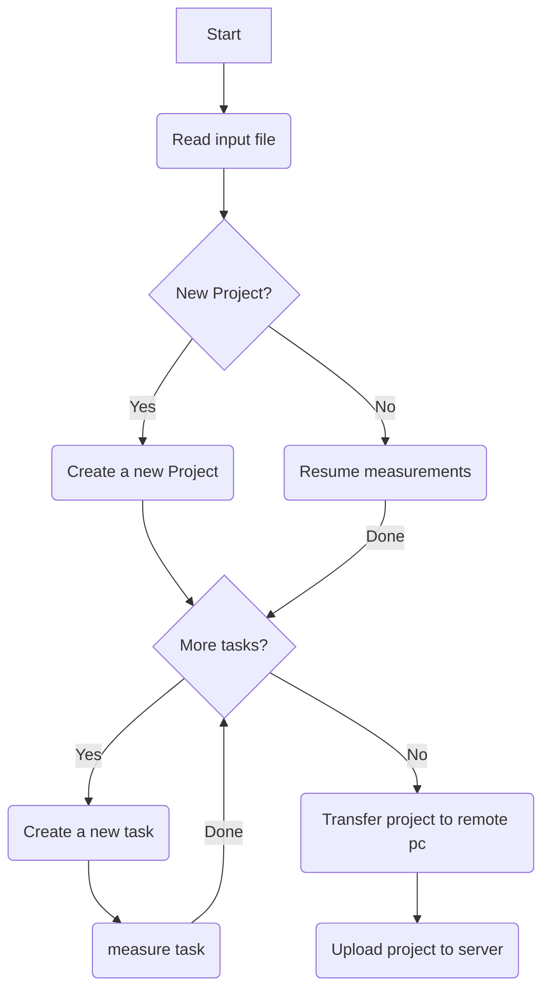
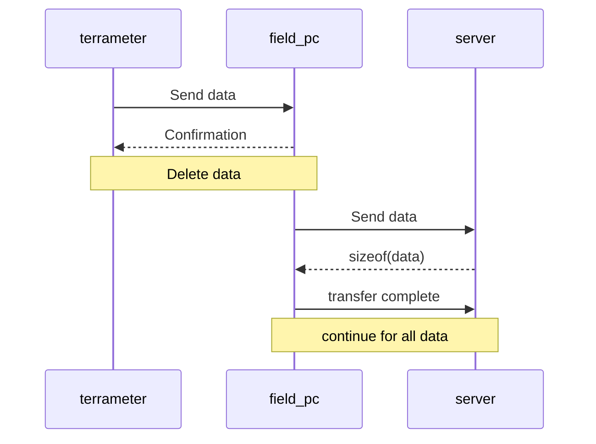

# Mermaid

## General Acquisiton flowchart (including backup)

```mermaid
flowchart
    main --> instruments
    instruments --> connection
    instruments --> commands
    instruments --> monitoring_logic  
    main --> utilities    
    commands --> utilities   
    utilities --> aux_one
    utilities --> aux_two
```

## Acquisition flowchart (for Terrameter)

```mermaid
flowchart
    main --> Terrameter
    Terrameter --> SSHConnection
    Terrameter --> terrameter_commands
    Terrameter --> monitoring_terrameter
    main --> utilities    
    terrameter_commands --> utilities    
```

## Monitoring logic for terrameter

```mermaid
flowchart
    S[Start] --> A;
    A(Read input file) --> B{New Project?};
    B --> |Yes| C(Create a new Project)
    C --> D{More tasks?}
    D --> |Yes| E(Create a new task)
    E --> F(measure task)
    F --> |Done| D
    B --> |No| CC(Resume measurements)
    CC(Resume measurements) --> |Done| D
    D --> |No| EEE(Transfer project to remote pc)
    EEE --> FFF(Upload project to server)
```

## Data handling

```mermaid
sequenceDiagram
    participant terrameter
    participant field_pc
    participant server
    terrameter->>field_pc: Send data
    field_pc-->>terrameter: Confirmation
    Note over terrameter, field_pc: Delete data
    field_pc->>server: Send data
    server-->>field_pc: sizeof(data)
    field_pc->>server: transfer complete
    Note over field_pc, server: continue for all data
```